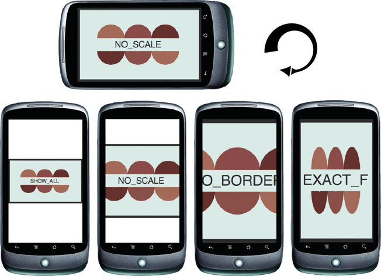

# Automatic orientation

When auto-orientation is on and a user rotates their device, the operating
system re-orients the entire user interface, including the system taskbar and
your application. As a result, the aspect ratio of the stage changes from
portrait to landscape or landscape to portrait. When the aspect ratio changes,
the stage dimensions also change.

Enable or disable auto-orientation at runtime, by setting the Stage
`autoOrients` property to `true` or `false`. You can set the initial value of
this property in the AIR application descriptor with the `<autoOrients>`
element. (Note that prior to AIR 2.6, `autoOrients` is a read-only property and
can only be set in the application descriptor.)

If you specify an aspect ratio of landscape or portrait and also enable
auto-orientation, AIR constrains auto-orientation to the specified aspect ratio.

#### Stage dimension changes

When the stage dimensions change, the stage contents are scaled and repositioned
as specified by the `scaleMode` and `align` properties of the Stage object. In
most cases, relying on the automatic behavior provided by the Stage `scaleMode`
settings does not produce good results. Instead you must re-layout or redraw
your graphics and components to support more than one aspect ratio. (Providing
flexible layout logic also means that your application will work better across
devices with different screen sizes and aspect ratios.)

The following illustration demonstrates the effects of the different `scaleMode`
settings when rotating a typical mobile device:

Rotation from landscape to portrait aspect ratio

The illustration demonstrates the scaling behavior that occurs when rotating
from a landscape aspect ratio to a portrait aspect ratio with different scale
modes. Rotating from portrait to landscape causes a similar set of effects.

#### Orientation change events

The Stage object dispatches two types of events that you can use to detect and
react to orientation changes. Both stage `resize` and `orientationChange` events
are dispatched when auto-orientation is enabled.

The _resize_ event is the best event to use when you are relying on
auto-orientation to keep the display upright. When the stage dispatches a
`resize` event, relayout or redraw your content, as needed. The `resize` event
is only dispatched when the stage scale mode is set to `noScale`.

The `orientationChange` event can also be used to detect orientation changes.
The `orientationChange` event is only dispatched when auto-orientation is
enabled.

Note: On some mobile platforms, the stage dispatches a cancelable
`orientationChanging` event before dispatching the resize or orientationChange
events. Since the event is not supported on all platforms, avoid relying on it.

