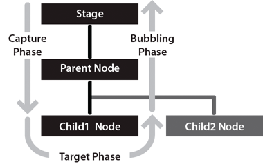

# Handling events for display objects

The DisplayObject class inherits from the EventDispatcher class. This means that
every display object can participate fully in the event model (described in
[Handling events](../../core-actionscript-classes/handling-events/index.md)).
Every display object can use its `addEventListener()` method—inherited from the
EventDispatcher class—to listen for a particular event, but only if the
listening object is part of the event flow for that event.

When Flash Player or AIR dispatches an event object, that event object makes a
round-trip journey from the Stage to the display object where the event
occurred. For example, if a user clicks on a display object named `child1`,
Flash Player dispatches an event object from the Stage through the display list
hierarchy down to the `child1` display object.

The event flow is conceptually divided into three phases, as illustrated in this
diagram:

For more information, see
[Handling events](../../core-actionscript-classes/handling-events/index.md).

One important issue to keep in mind when working with display object events is
the effect that event listeners can have on whether display objects are
automatically removed from memory (garbage collected) when they're removed from
the display list. If a display object has objects subscribed as listeners to its
events, that display object will not be removed from memory even when it's
removed from the display list, because it will still have references to those
listener objects. For more information, see
[Managing event listeners](../../core-actionscript-classes/handling-events/event-listeners.md#managing-event-listeners).

