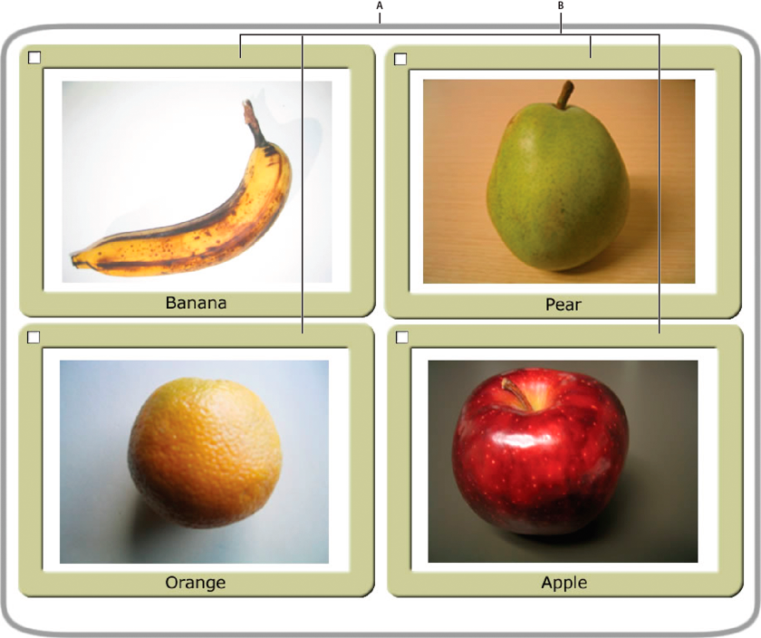
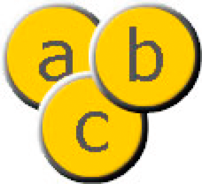

# Working with display object containers

If a DisplayObjectContainer object is deleted from the display list, or if it is
moved or transformed in some other way, each display object in the
DisplayObjectContainer is also deleted, moved, or transformed.

A display object container is itself a type of display object—it can be added to
another display object container. For example, the following image shows a
display object container, `pictureScreen`, that contains one outline shape and
four other display object containers (of type PictureFrame):

**A.** A shape defining the border of the pictureScreen display object container

**B.** Four display object containers that are children of the pictureScreen
object

In order to have a display object appear in the display list, you must add it to
a display object container that is on the display list. You do this by using the
`addChild()` method or the `addChildAt()` method of the container object. For
example, without the final line of the following code, the `myTextField` object
would not be displayed:

    var myTextField:TextField = new TextField();
    myTextField.text = "hello";
    this.root.addChild(myTextField);

In this code sample, `this.root` points to the MovieClip display object
container that contains the code. In your actual code, you may specify a
different container.

Use the `addChildAt()` method to add the child to a specific position in the
child list of the display object container. These zero-based index positions in
the child list relate to the layering (the front-to-back order) of the display
objects. For example, consider the following three display objects. Each object
was created from a custom class called Ball.

The layering of these display objects in their container can be adjusted using
the `addChildAt()` method. For example, consider the following code:

    ball_A = new Ball(0xFFCC00, "a");
    ball_A.name = "ball_A";
    ball_A.x = 20;
    ball_A.y = 20;
    container.addChild(ball_A);

    ball_B = new Ball(0xFFCC00, "b");
    ball_B.name = "ball_B";
    ball_B.x = 70;
    ball_B.y = 20;
    container.addChild(ball_B);

    ball_C = new Ball(0xFFCC00, "c");
    ball_C.name = "ball_C";
    ball_C.x = 40;
    ball_C.y = 60;
    container.addChildAt(ball_C, 1);

After executing this code, the display objects are positioned as follows in the
`container` DisplayObjectContainer object. Notice the layering of the objects.

To reposition an object to the top of the display list, simply re-add it to the
list. For example, after the previous code, to move `ball_A` to the top of the
stack, use this line of code:

    container.addChild(ball_A);

This code effectively removes `ball_A` from its location in `container` 's
display list, and re-adds it to the top of the list—which has the end result of
moving it to the top of the stack.

You can use the `getChildAt()` method to verify the layer order of the display
objects. The `getChildAt()` method returns child objects of a container based on
the index number you pass it. For example, the following code reveals names of
display objects at different positions in the child list of the `container`
DisplayObjectContainer object:

    trace(container.getChildAt(0).name); // ball_A
    trace(container.getChildAt(1).name); // ball_C
    trace(container.getChildAt(2).name); // ball_B

If you remove a display object from the parent container's child list, the
higher elements on the list each move down a position in the child index. For
example, continuing with the previous code, the following code shows how the
display object that was at position 2 in the `container` DisplayObjectContainer
moves to position 1 if a display object that is lower in the child list is
removed:

    container.removeChild(ball_C);
    trace(container.getChildAt(0).name); // ball_A
    trace(container.getChildAt(1).name); // ball_B

The `removeChild()` and `removeChildAt()` methods do not delete a display object
instance entirely. They simply remove it from the child list of the container.
The instance can still be referenced by another variable. (Use the `delete`
operator to completely remove an object.)

Because a display object has only one parent container, you can add an instance
of a display object to only one display object container. For example, the
following code shows that the display object `tf1` can exist in only one
container (in this case, a Sprite, which extends the DisplayObjectContainer
class):

    tf1:TextField = new TextField();
    tf2:TextField = new TextField();
    tf1.name = "text 1";
    tf2.name = "text 2";

    container1:Sprite = new Sprite();
    container2:Sprite = new Sprite();

    container1.addChild(tf1);
    container1.addChild(tf2);
    container2.addChild(tf1);

    trace(container1.numChildren); // 1
    trace(container1.getChildAt(0).name); // text 2
    trace(container2.numChildren); // 1
    trace(container2.getChildAt(0).name); // text 1

If you add a display object that is contained in one display object container to
another display object container, it is removed from the first display object
container's child list.

In addition to the methods described above, the DisplayObjectContainer class
defines several methods for working with child display objects, including the
following:

- `contains()` : Determines whether a display object is a child of a
  DisplayObjectContainer.

- `getChildByName()` : Retrieves a display object by name.

- `getChildIndex()` : Returns the index position of a display object.

- `setChildIndex()` : Changes the position of a child display object.

- `removeChildren()` : Removes multiple child display objects.

- `swapChildren()` : Swaps the front-to-back order of two display objects.

- `swapChildrenAt()` : Swaps the front-to-back order of two display objects,
  specified by their index values.

For more information, see the
[DisplayObjectContainer](https://help.adobe.com/en_US/FlashPlatform/reference/actionscript/3/flash/display/DisplayObjectContainer.html)
class listing in the
[ActionScript 3.0 Reference for the Adobe Flash Platform](https://help.adobe.com/en_US/FlashPlatform/reference/actionscript/3/index.html).

Recall that a display object that is off the display list—one that is not
included in a display object container that is a child of the Stage—is known as
an _off-list_ display object.
