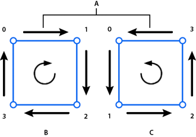
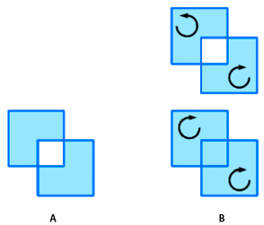
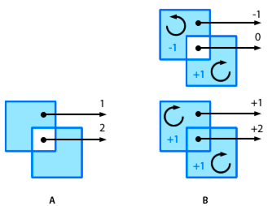
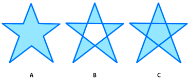

# Defining winding rules

The enhanced drawing API also introduces the concept of path "winding": the
direction for a path. The winding for a path is either positive (clockwise) or
negative (counter-clockwise). The order in which the renderer interprets the
coordinates provided by the vector for the data parameter determines the
winding.

Positive and negative winding

A.  
Arrows indicate drawing direction

B.  
Positively wound (clockwise)

C.  
Negatively wound (counter-clockwise)

Additionally, notice that the `Graphics.drawPath()` method has an optional third
parameter called "winding":

    drawPath(commands:Vector.<int>, data:Vector.<Number>, winding:String = "evenOdd"):void

In this context, the third parameter is a string or a constant that specifies
the winding or fill rule for intersecting paths. (The constant values are
defined in the GraphicsPathWinding class as `GraphicsPathWinding.EVEN_ODD` or
`GraphicsPathWinding.NON_ZERO`.) The winding rule is important when paths
intersect.

The even-odd rule is the standard winding rule and is the rule used by the
legacy drawing API. The Even-odd rule is also the default rule for the
`Graphics.drawPath()` method. With the even-odd winding rule, any intersecting
paths alternate between open and closed fills. If two squares drawn with the
same fill intersect, the area in which the intersection occurs is filled.
Generally, adjacent areas are neither both filled nor both unfilled.

The non-zero rule, on the other hand, depends on winding (drawing direction) to
determine whether areas defined by intersecting paths are filled. When paths of
opposite winding intersect, the area defined is unfilled, much like with
even-odd. For paths of the same winding, the area that would be unfilled is
filled:

Winding rules for intersecting areas

A.  
Even-odd winding rule

B.  
Non-zero winding rule

## Winding rule names

The names refer to a more specific rule that defines how these fills are
managed. Positively wound paths are assigned a value of +1; negatively wound
paths are assigned a value of -1. Starting from a point within an enclosed area
of a shape, draw a line from that point extending out indefinitely. The number
of times that line crosses a path, and the combined values of those paths, are
used to determine the fill. For even-odd winding, the count of times the line
crosses a path is used. When the count is odd, the area is filled. For even
counts, the area is unfilled. For non-zero winding, the values assigned to the
paths are used. When the combined values of the path are not 0, the area is
filled. When the combined value is 0, the area is unfilled.

Winding rule counts and fills

A.  
Even-odd winding rule

B.  
Non-zero winding rule

## Using winding rules

These fill rules are complicated, but in some situations they are necessary. For
example, consider drawing a star shape. With the standard even-odd rule, the
shape would require ten different lines. With the non-zero winding rule, those
ten lines are reduced to five. Here is the ActionScript for a star with five
lines and a non-zero winding rule:

    graphics.beginFill(0x60A0FF);
    graphics.drawPath( Vector.<int>([1,2,2,2,2]),  Vector.<Number>([66,10, 23,127, 122,50, 10,49, 109,127]),   GraphicsPathWinding.NON_ZERO);

And here is the star shape:

A star shape using different winding rules

A.  
Even-odd 10 lines

B.  
Even-odd 5 lines

C.  
Non-zero 5 lines

And, as images are animated or used as textures on three-dimensional objects and
overlap, the winding rules become more important.

