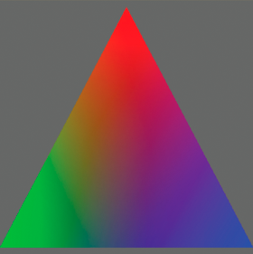

# Using a shader as a drawing fill

When you use a shader to create a drawing fill, you use the drawing api methods
to create a vector shape. The shader’s output is used to fill in the shape, in
the same way that any bitmap image can be used as a bitmap fill with the drawing
api. To create a shader fill, at the point in your code at which you want to
start drawing the shape, call the Graphics object’s `beginShaderFill()` method.
Pass the Shader object as the first argument to the `beginShaderFill()` method,
as shown in this listing:

    var canvas:Sprite = new Sprite();
    canvas.graphics.beginShaderFill(myShader);
    canvas.graphics.drawRect(10, 10, 150, 150);
    canvas.graphics.endFill();
    // add canvas to the display list to see the result

When you use a shader as a drawing fill, you set any input image values and
parameter values that the shader requires.

The following example demonstrates using a shader as a drawing fill. In this
example, the shader creates a three-point gradient. This gradient has three
colors, each at the point of a triangle, with a gradient blend between them. In
addition, the colors rotate to create an animated spinning color effect.

Note: The code for this example was written by Petri Leskinen. Thank you Petri
for sharing this example. You can see more of Petri’s examples and tutorials at
<a href="http://pixelero.wordpress.com/"
target="_self">http://pixelero.wordpress.com/</a>.

The ActionScript code is in three methods:

- `init()`: The `init()` method is called when the application loads. In this
  method the code sets the initial values for the Point objects representing the
  points of the triangle. The also code creates a Sprite instance named
  `canvas`. Later, in the `updateShaderFill()`, the code draws the shader result
  into `canvas` once per frame. Finally, the code loads the shader bytecode
  file.

- `onLoadComplete()`: In the `onLoadComplete()` method the code creates the
  Shader object named `shader`. It also sets the initial parameter values.
  Finally, the code adds the `updateShaderFill()` method as a listener for the
  `enterFrame` event, meaning that it is called once per frame to create an
  animation effect.

- `updateShaderFill()`: The `updateShaderFill()` method is called once per
  frame, creating the animation effect. In this method, the code calculates and
  sets the shader parameters’ values. The code then calls the
  `beginShaderFill()` method to create a shader fill and calls other drawing api
  methods to draw the shader result in a triangle.

The following is the ActionScript code for this example. Use this class as the
main application class for an ActionScript-only project in Flash Builder, or as
the document class for a FLA file in Flash Professional:

    package
    {
    import flash.display.Shader;
    import flash.display.Sprite;
    import flash.events.Event;
    import flash.geom.Point;
    import flash.net.URLLoader;
    import flash.net.URLLoaderDataFormat;
    import flash.net.URLRequest;

    public class ThreePointGradient extends Sprite
    {
        private var canvas:Sprite;
        private var shader:Shader;
        private var loader:URLLoader;

        private var topMiddle:Point;
        private var bottomLeft:Point;
        private var bottomRight:Point;

        private var colorAngle:Number = 0.0;
        private const d120:Number = 120 / 180 * Math.PI; // 120 degrees in radians

        public function ThreePointGradient()
        {
            init();
        }

        private function init():void
        {
            canvas = new Sprite();
            addChild(canvas);

            var size:int = 400;
            topMiddle = new Point(size / 2, 10);
            bottomLeft = new Point(0, size - 10);
            bottomRight = new Point(size, size - 10);

            loader = new URLLoader();
            loader.dataFormat = URLLoaderDataFormat.BINARY;
            loader.addEventListener(Event.COMPLETE, onLoadComplete);
            loader.load(new URLRequest("ThreePointGradient.pbj"));
        }

        private function onLoadComplete(event:Event):void
        {
            shader = new Shader(loader.data);

            shader.data.point1.value = [topMiddle.x, topMiddle.y];
            shader.data.point2.value = [bottomLeft.x, bottomLeft.y];
            shader.data.point3.value = [bottomRight.x, bottomRight.y];

            addEventListener(Event.ENTER_FRAME, updateShaderFill);
        }

        private function updateShaderFill(event:Event):void
        {
            colorAngle += .06;

            var c1:Number = 1 / 3 + 2 / 3 * Math.cos(colorAngle);
            var c2:Number = 1 / 3 + 2 / 3 * Math.cos(colorAngle + d120);
            var c3:Number = 1 / 3 + 2 / 3 * Math.cos(colorAngle - d120);

            shader.data.color1.value = [c1, c2, c3, 1.0];
            shader.data.color2.value = [c3, c1, c2, 1.0];
            shader.data.color3.value = [c2, c3, c1, 1.0];

            canvas.graphics.clear();
            canvas.graphics.beginShaderFill(shader);

            canvas.graphics.moveTo(topMiddle.x, topMiddle.y);
            canvas.graphics.lineTo(bottomLeft.x, bottomLeft.y);
            canvas.graphics.lineTo(bottomRight.x, bottomLeft.y);

            canvas.graphics.endFill();
        }
    }
    }

The following is the source code for the ThreePointGradient shader kernel, used
to create the “ThreePointGradient.pbj” Pixel Bender bytecode file:

    <languageVersion : 1.0;>
    kernel ThreePointGradient
    <
    namespace : "Petri Leskinen::Example";
    vendor : "Petri Leskinen";
    version : 1;
    description : "Creates a gradient fill using three specified points and colors.";
    >
    {
    parameter float2 point1 // coordinates of the first point
    <
        minValue:float2(0, 0);
        maxValue:float2(4000, 4000);
        defaultValue:float2(0, 0);
    >;

    parameter float4 color1 // color at the first point, opaque red by default
    <
        defaultValue:float4(1.0, 0.0, 0.0, 1.0);
    >;

    parameter float2 point2 // coordinates of the second point
    <
        minValue:float2(0, 0);
        maxValue:float2(4000, 4000);
        defaultValue:float2(0, 500);
    >;

    parameter float4 color2 // color at the second point, opaque green by default
    <
        defaultValue:float4(0.0, 1.0, 0.0, 1.0);
    >;

    parameter float2 point3 // coordinates of the third point
    <
        minValue:float2(0, 0);
        maxValue:float2(4000, 4000);
        defaultValue:float2(0, 500);
    >;

    parameter float4 color3 // color at the third point, opaque blue by default
    <
        defaultValue:float4(0.0, 0.0, 1.0, 1.0);
    >;

    output pixel4 dst;

    void evaluatePixel()
    {
        float2 d2 = point2 - point1;
        float2 d3 = point3 - point1;

        // transformation to a new coordinate system
        // transforms point 1 to origin, point2 to (1, 0), and point3 to (0, 1)
        float2x2 mtrx = float2x2(d3.y, -d2.y, -d3.x, d2.x) / (d2.x * d3.y - d3.x * d2.y);
        float2 pNew = mtrx * (outCoord() - point1);

        // repeat the edge colors on the outside
        pNew.xy = clamp(pNew.xy, 0.0, 1.0); // set the range to 0.0 ... 1.0

        // interpolating the output color or alpha value
        dst = mix(mix(color1, color2, pNew.x), color3, pNew.y);
    }
    }

Note: If you use a shader fill when rendering under the graphics processing unit
(GPU), the filled area will be colored cyan.

For more information about drawing shapes using the drawing api, see
[Using the drawing API](../using-the-drawing-api/index.md).

