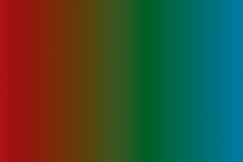

# Using a shader as a filter

Using a shader as a filter is like using any of the other filters in
ActionScript. When you use a shader as a filter, the filtered image (a display
object or BitmapData object) is passed to the shader. The shader uses the input
image to create the filter output, which is usually a modified version of the
original image. If the filtered object is a display object the shader's output
is displayed on the screen in place of the filtered display object. If the
filtered object is a BitmapData object, the shader's output becomes the content
of the BitmapData object whose `applyFilter()` method is called.

To use a shader as a filter, you first create the Shader object as described in
[Loading or embedding a shader](./loading-or-embedding-a-shader.md). Next you
create a ShaderFilter object linked to the Shader object. The ShaderFilter
object is the filter that is applied to the filtered object. You apply it to an
object in the same way that you apply any filter. You pass it to the `filters`
property of a display object or you call the `applyFilter()` method on a
BitmapData object. For example, the following code creates a ShaderFilter object
and applies the filter to a display object named `homeButton`.

    var myFilter:ShaderFilter = new ShaderFilter(myShader);
    homeButton.filters = [myFilter];

When you use a shader as a filter, the shader must be defined with at least one
input. As the example shows, you do not set the input value in your code.
Instead, the filtered display object or BitmapData object is set as the input
image. If you use a shader that expects more than one input, you provide a value
for any input beyond the first one.

In some cases, a filter changes the dimensions of the original image. For
example, a typical drop shadow effect adds extra pixels containing the shadow
that's added to the image. When you use a shader that changes the image
dimensions, set the `leftExtension`, `rightExtension`, `topExtension`, and
`bottomExtension` properties to indicate by how much you want the image size to
change.

The following example demonstrates using a shader as a filter. The filter in
this example inverts the red, green, and blue channel values of an image. The
result is the "negative" version of the image.

Note: The shader that this example uses is the invertRGB.pbk Pixel Bender kernel
that is included with the Pixel Bender Toolkit. You can load the source code for
the kernel from the Pixel Bender Toolkit installation directory. Compile the
source code and save the bytecode file in the same directory as the source code.

The important ActionScript code is in these two methods:

- `init()`: The `init()` method is called when the application loads. In this
  method the code loads the shader bytecode file.

- `onLoadComplete()`: In the `onLoadComplete()` method the code creates the
  Shader object named `shader`. It then creates and draws the contents of an
  object named `target`. The `target` object is a rectangle filled with a linear
  gradient color that is red on the left, yellow-green in the middle, and light
  blue on the right. The unfiltered object looks like this:

  

  With the filter applied the colors are inverted, making the rectangle look
  like this:

  

The shader that this example uses is the "invertRGB.pbk" sample Pixel Bender
kernel that is included with the Pixel Bender Toolkit. The source code is
available in the file "invertRGB.pbk" in the Pixel Bender Toolkit installation
directory. Compile the source code and save the bytecode file with the name
"invertRGB.pbj" in the same directory as your ActionScript source code.

The following is the ActionScript code for this example. Use this class as the
main application class for an ActionScript-only project in Flash Builder, or as
the document class for the FLA file in Flash Professional:

    package
    {
        import flash.display.GradientType;
        import flash.display.Graphics;
        import flash.display.Shader;
        import flash.display.Shape;
        import flash.display.Sprite;
        import flash.filters.ShaderFilter;
        import flash.events.Event;
        import flash.geom.Matrix;
        import flash.net.URLLoader;
        import flash.net.URLLoaderDataFormat;
        import flash.net.URLRequest;

        public class InvertRGB extends Sprite
        {
            private var shader:Shader;
            private var loader:URLLoader;

            public function InvertRGB()
            {
                init();
            }

            private function init():void
            {
                loader = new URLLoader();
                loader.dataFormat = URLLoaderDataFormat.BINARY;
                loader.addEventListener(Event.COMPLETE, onLoadComplete);
                loader.load(new URLRequest("invertRGB.pbj"));
            }

            private function onLoadComplete(event:Event):void
            {
                shader = new Shader(loader.data);

                var target:Shape = new Shape();
                addChild(target);

                var g:Graphics = target.graphics;
                var c:Array = [0x990000, 0x445500, 0x007799];
                var a:Array = [255, 255, 255];
                var r:Array = [0, 127, 255];
                var m:Matrix = new Matrix();
                m.createGradientBox(w, h);
                g.beginGradientFill(GradientType.LINEAR, c, a, r, m);
                g.drawRect(10, 10, w, h);
                g.endFill();

                var invertFilter:ShaderFilter = new ShaderFilter(shader);
                target.filters = [invertFilter];
            }
        }
    }

For more information on applying filters, see
[Creating and applying filters](../filtering-display-objects/creating-and-applying-filters.md).
